# AI Resume Chat - Sequence Diagrams

## Complete Chat Flow

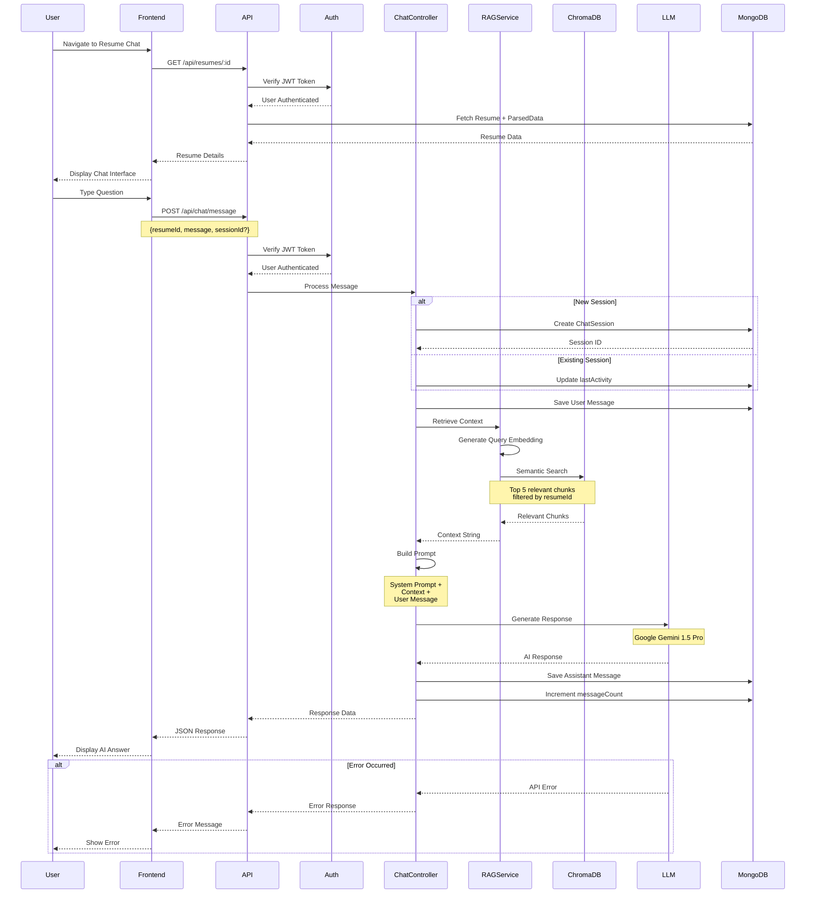

## Session Management

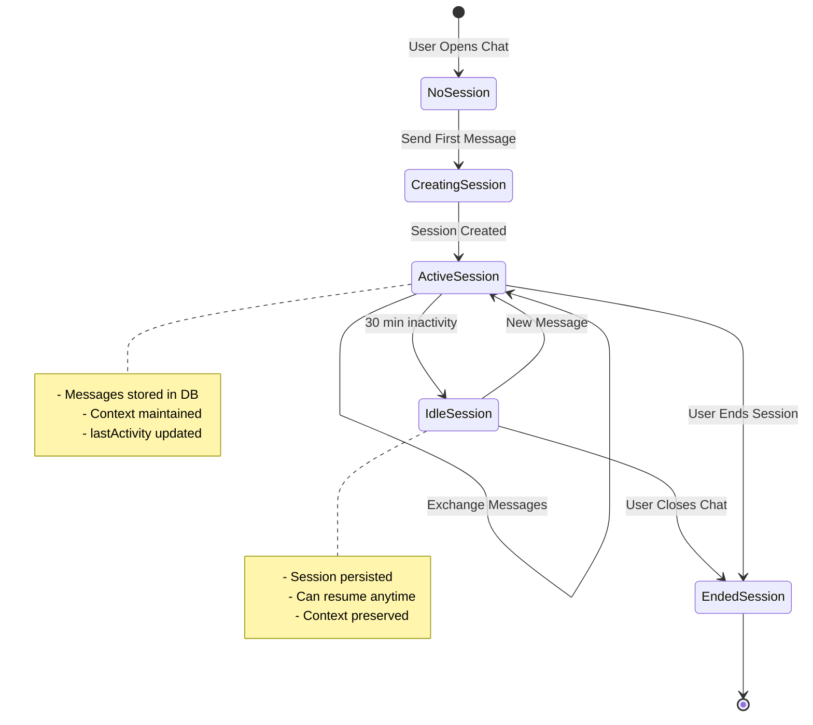

## Message Processing Pipeline

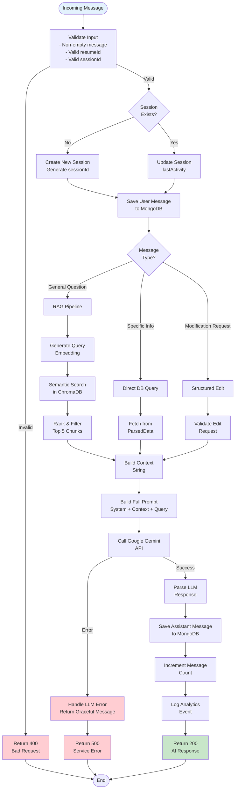

## Context Building Strategy

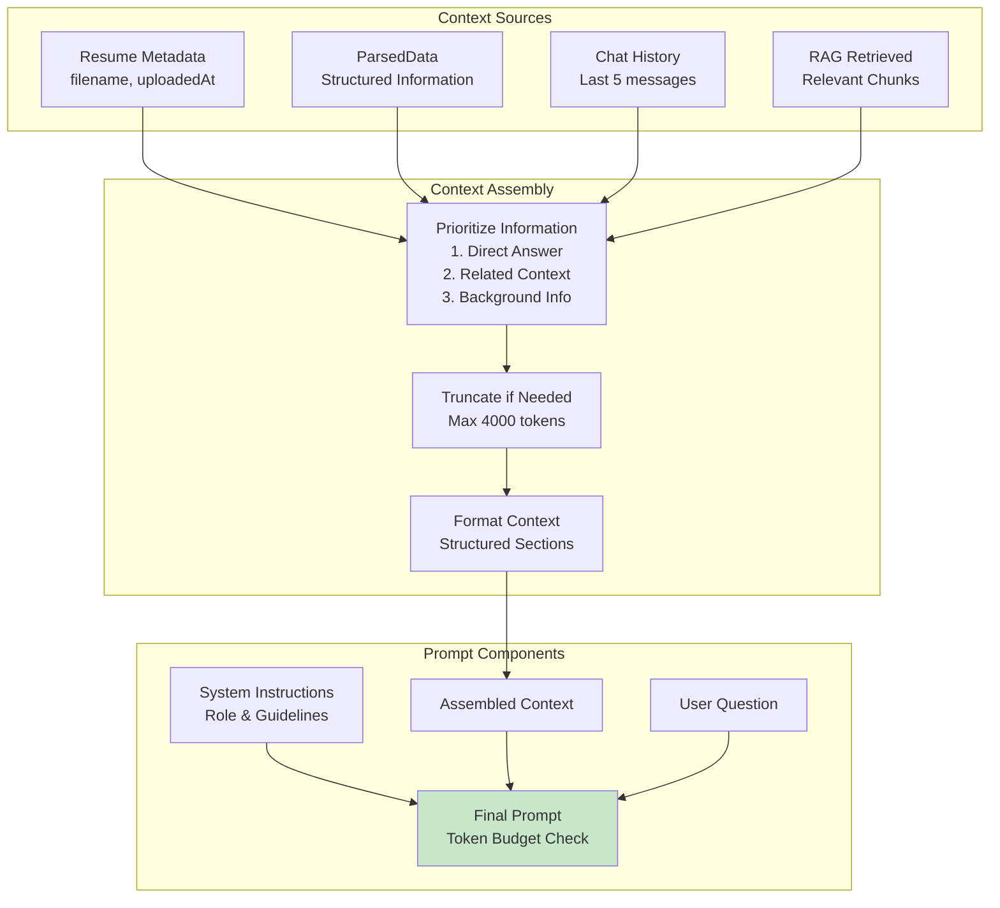

## Conversation Flow Types

### 1. Information Retrieval

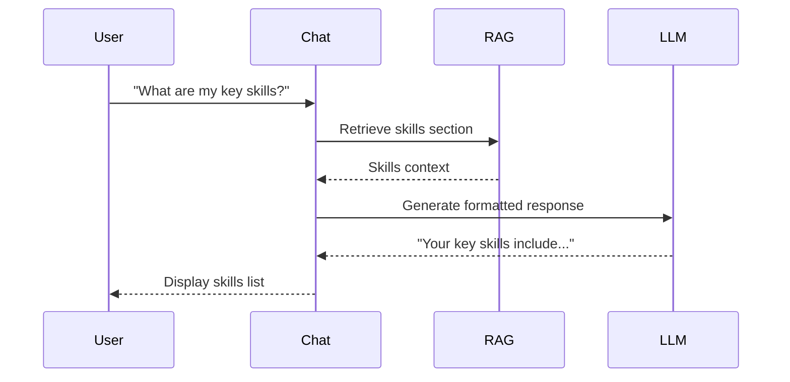

### 2. Analysis & Advice

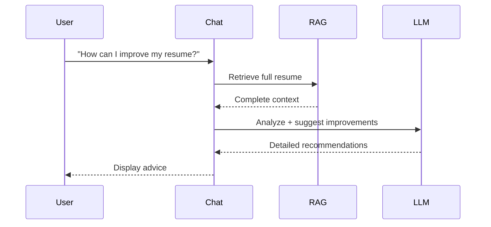

### 3. Comparison & Matching

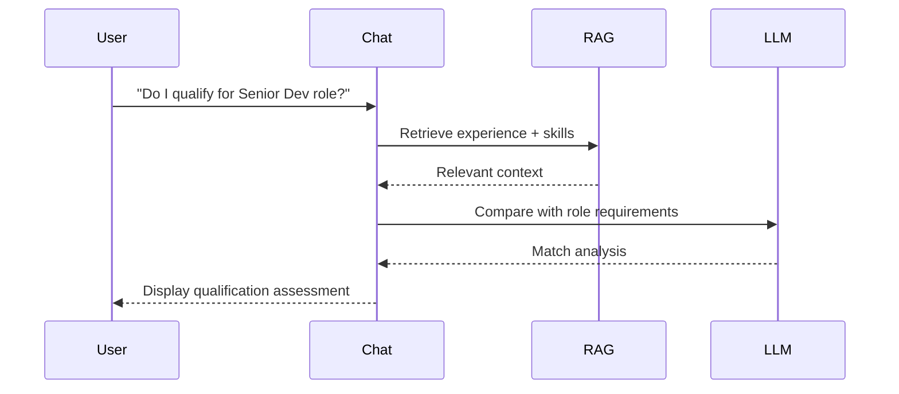

### 4. Multi-Turn Conversation

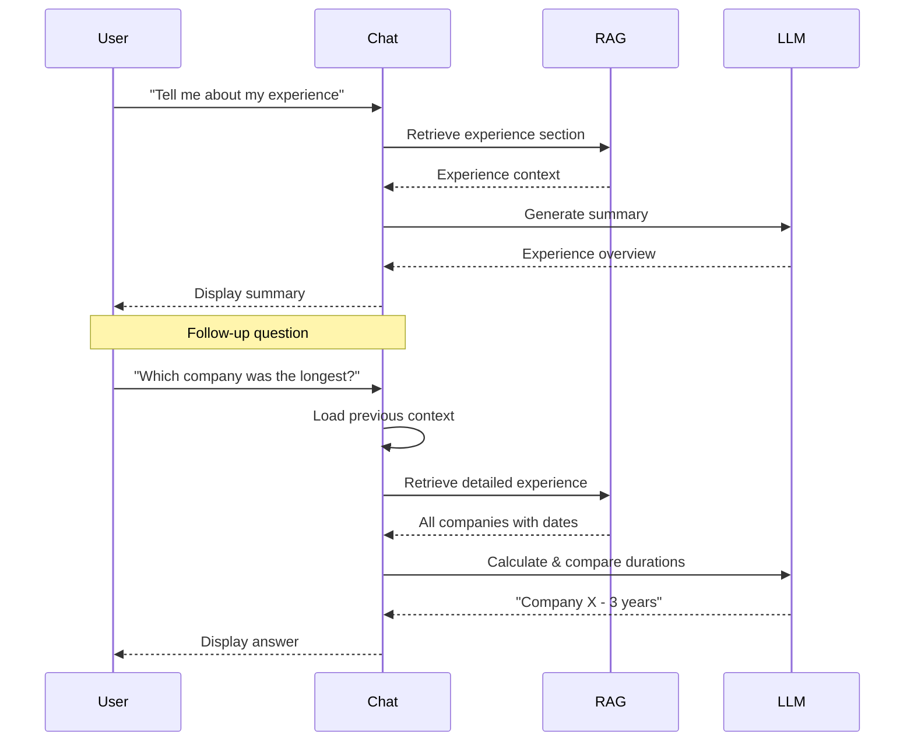

## Real-time Streaming Response

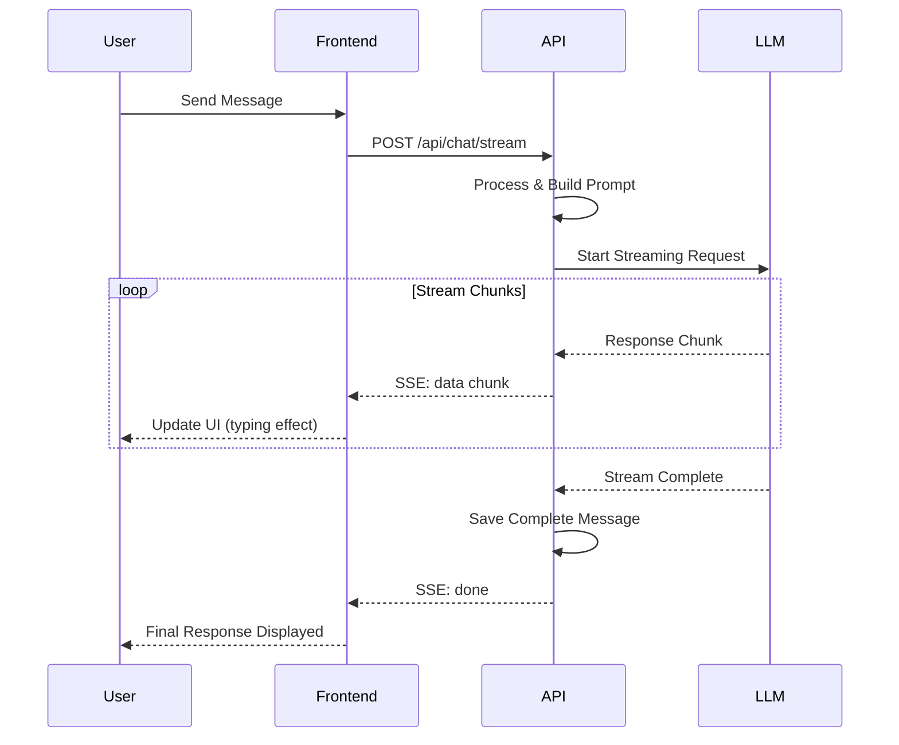

## Error Handling in Chat

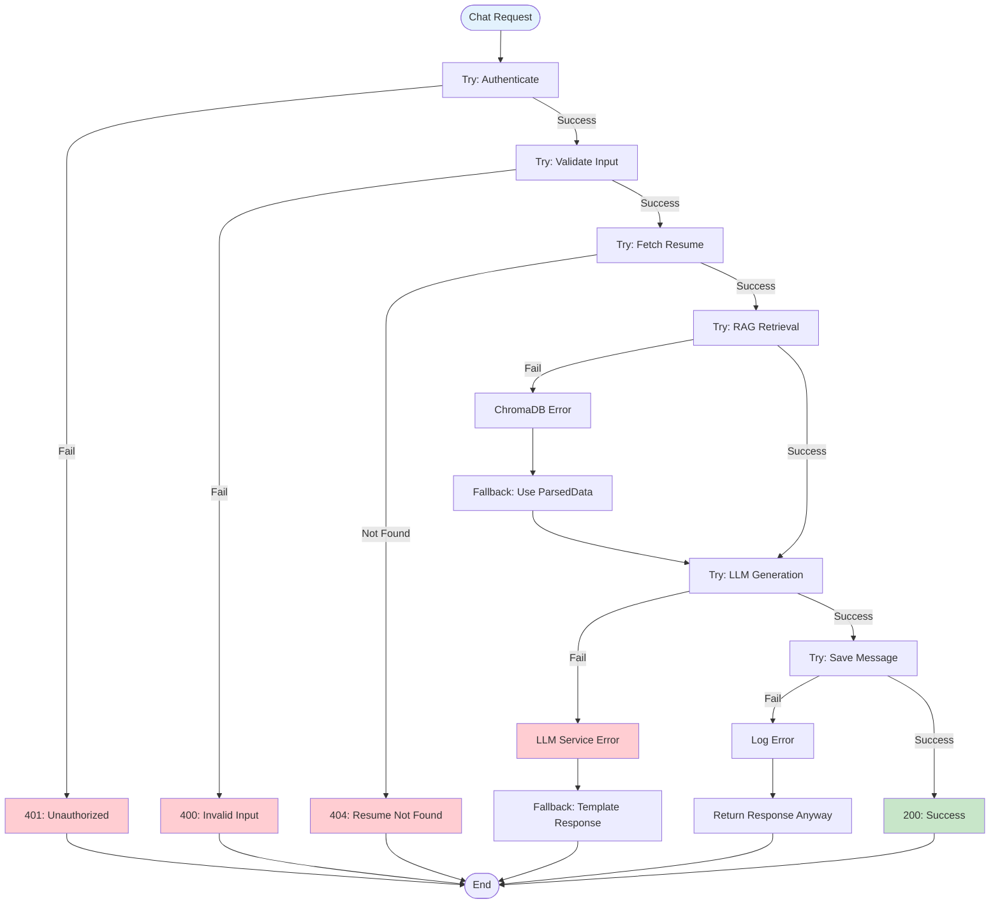

## Chat Performance Optimization

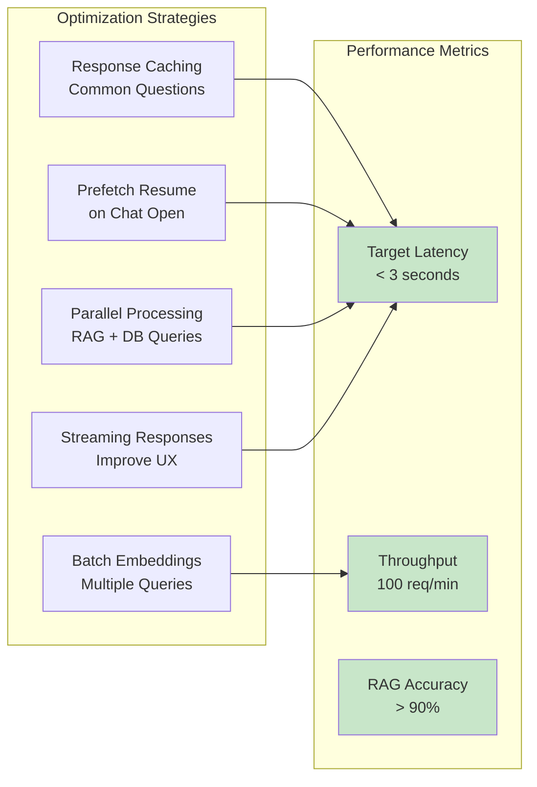

## Chat Analytics Tracking

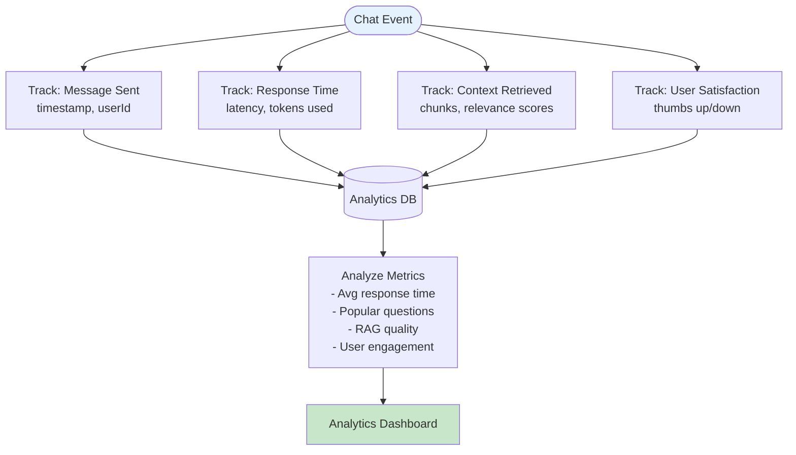

## Future Enhancements

### Planned Features
1. **Voice Input/Output**: Speech-to-text and text-to-speech
2. **Multi-Resume Chat**: Query across all user's resumes
3. **Proactive Suggestions**: AI suggests improvements unprompted
4. **Context Window Management**: Smart truncation for long conversations
5. **Conversation Branching**: Fork conversations for different scenarios
6. **Export Chat Transcripts**: Save conversations as PDF/TXT
7. **Collaborative Chat**: Share chat sessions with career advisors
8. **Smart Notifications**: Alert users to important insights
