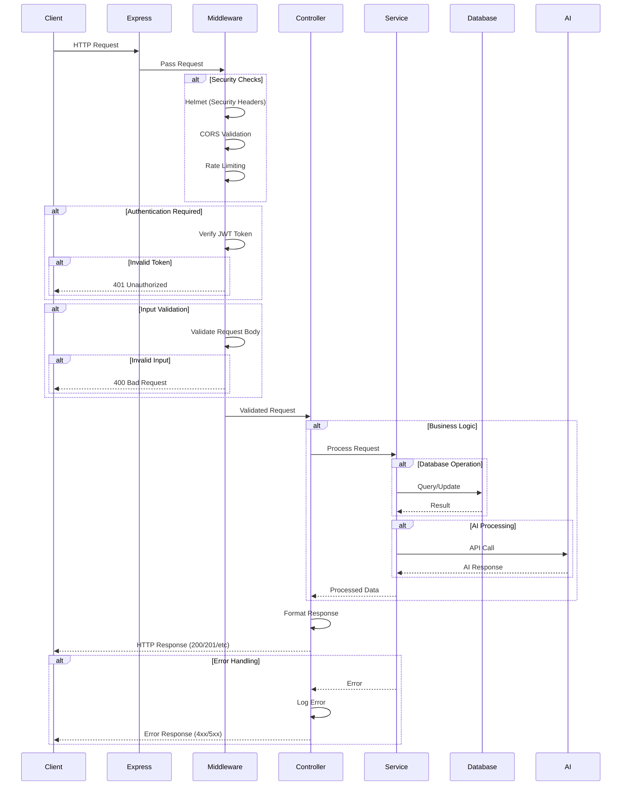
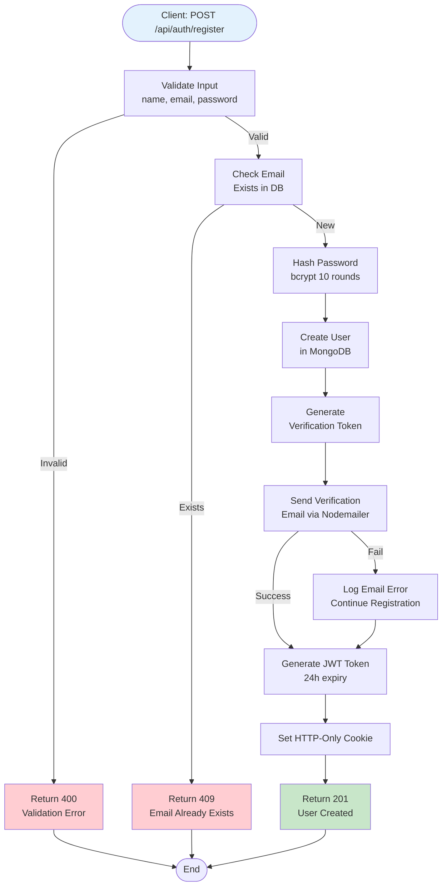
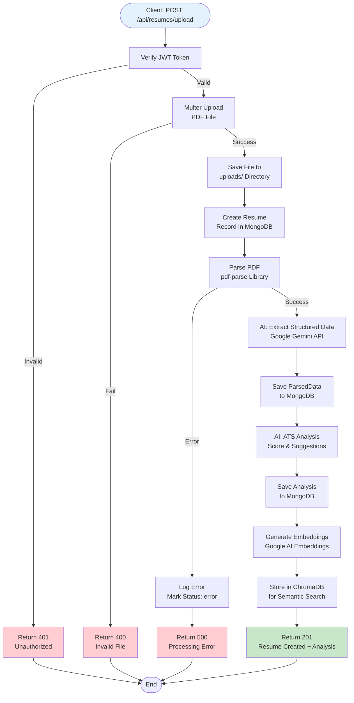
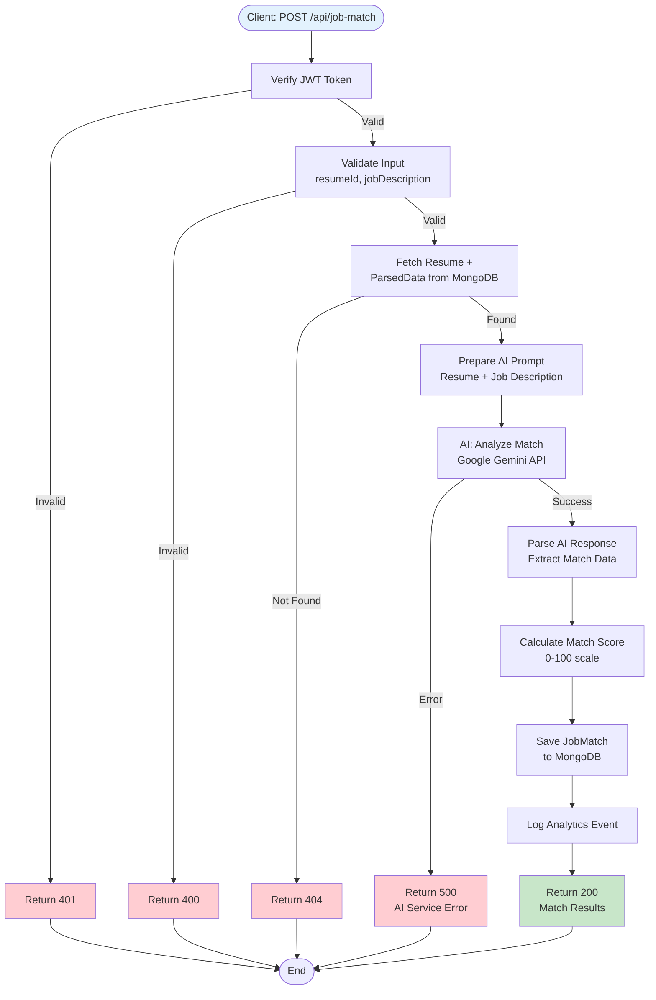
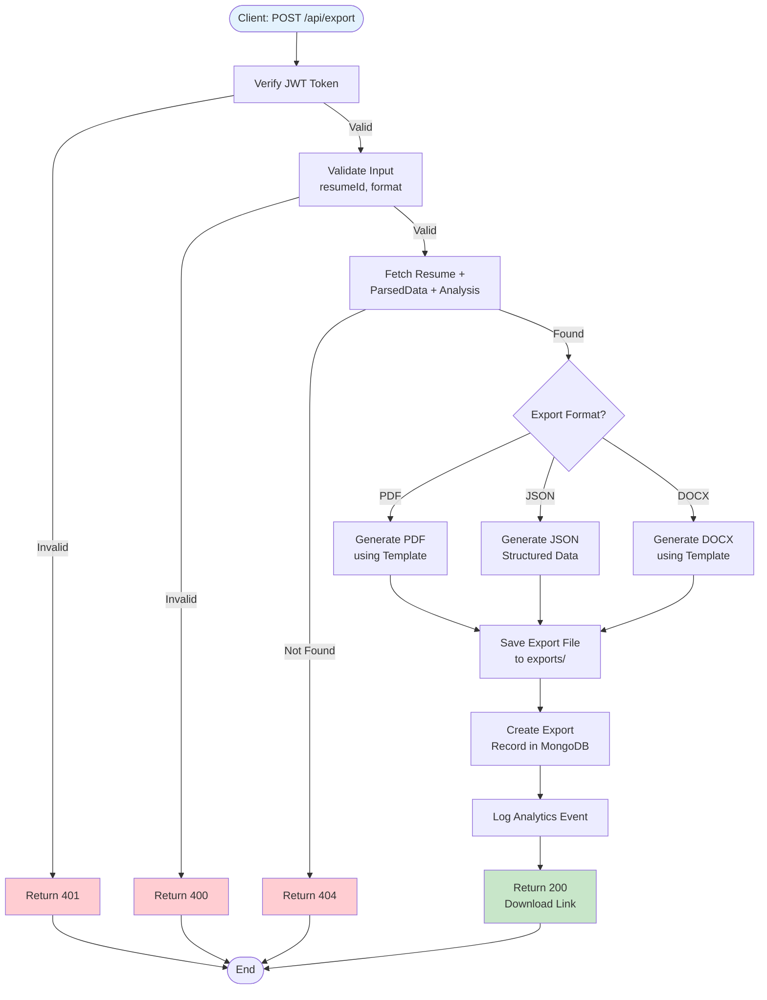
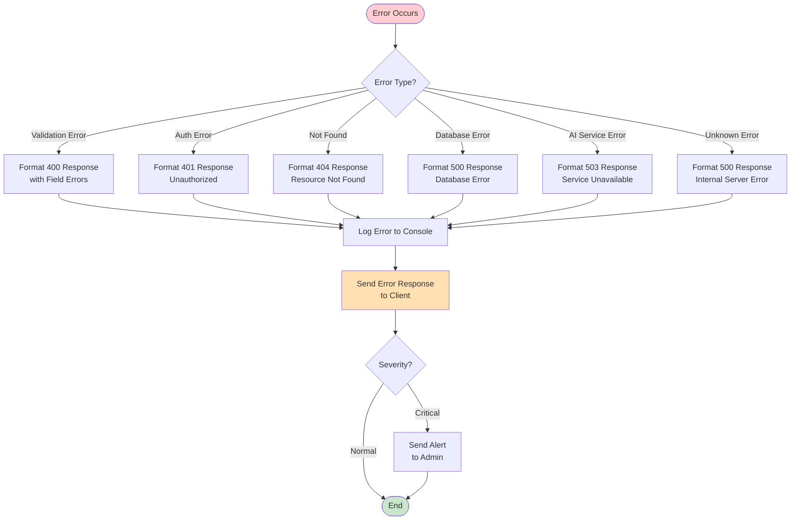

# ResumeAI API Request Flow

## Backend Request Flow Diagram



## Detailed Flow by Feature

### 1. User Registration Flow



### 2. Resume Upload & Analysis Flow



### 3. Job Matching Flow



### 4. Export Flow



## Middleware Pipeline

```mermaid
graph LR
    Request[Incoming Request] --> Helmet[Helmet<br/>Security Headers]
    Helmet --> CORS[CORS<br/>Origin Check]
    CORS --> RateLimit[Rate Limiter<br/>100/15min]
    RateLimit --> BodyParser[Body Parser<br/>JSON/URL-encoded]
    BodyParser --> FileUpload{File Upload?}
    
    FileUpload -->|Yes| Multer[Multer<br/>File Processing]
    FileUpload -->|No| Auth{Auth Required?}
    Multer --> Auth
    
    Auth -->|Yes| JWTVerify[JWT Verification]
    Auth -->|No| Validation
    JWTVerify -->|Invalid| Reject401[401 Response]
    JWTVerify -->|Valid| AttachUser[Attach User to req]
    
    AttachUser --> Validation[Input Validation<br/>express-validator]
    Validation -->|Invalid| Reject400[400 Response]
    Validation -->|Valid| Controller[Route Controller]
    
    Controller --> Response[HTTP Response]

    style Request fill:#e3f2fd
    style Response fill:#c8e6c9
    style Reject401 fill:#ffcdd2
    style Reject400 fill:#ffcdd2
```



## Error Handling Flow



## Response Format Standards

### Success Response
```json
{
  "success": true,
  "message": "Operation successful",
  "data": {
    // Response data
  },
  "timestamp": "2024-01-15T10:30:00Z"
}
```

### Error Response
```json
{
  "success": false,
  "error": "Error message",
  "details": [
    {
      "field": "email",
      "message": "Invalid email format"
    }
  ],
  "timestamp": "2024-01-15T10:30:00Z"
}
```

## Performance Optimization

### Caching Strategy
- **Response Caching**: Cache GET requests for resume lists (5 min TTL)
- **Database Query Caching**: Mongoose query result caching
- **Static Assets**: CDN caching for frontend assets
- **API Rate Limiting**: Prevent abuse and ensure fair usage

### Async Processing
- **File Upload**: Async file processing with status updates
- **AI Analysis**: Queue-based processing for long-running tasks
- **Email Sending**: Non-blocking email operations
- **Analytics**: Batch analytics event processing
