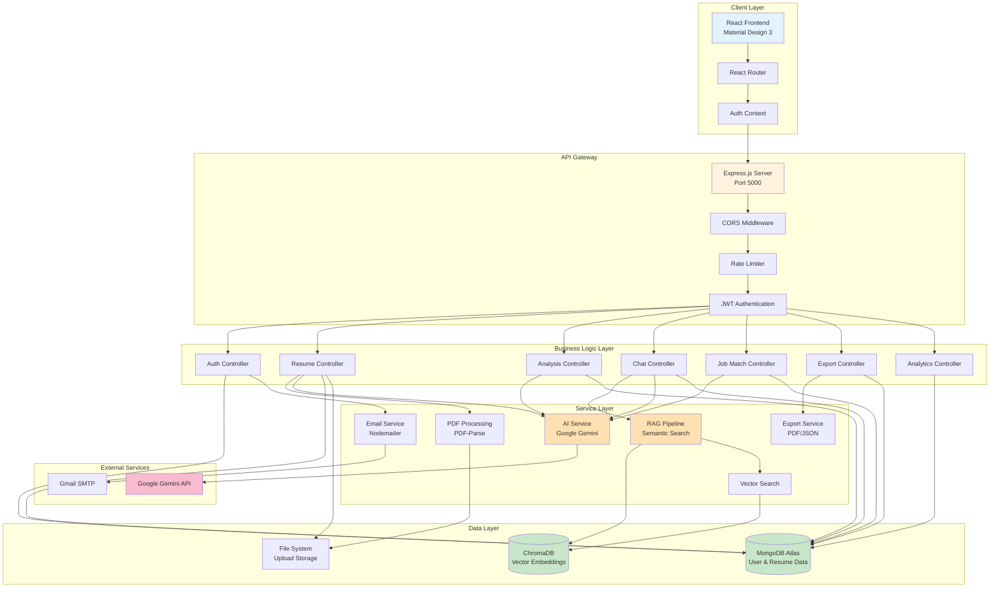
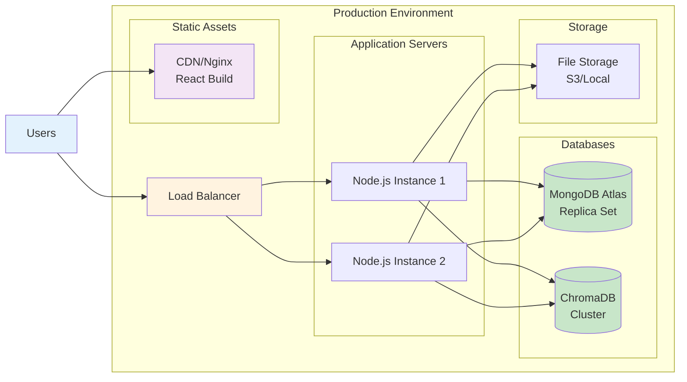
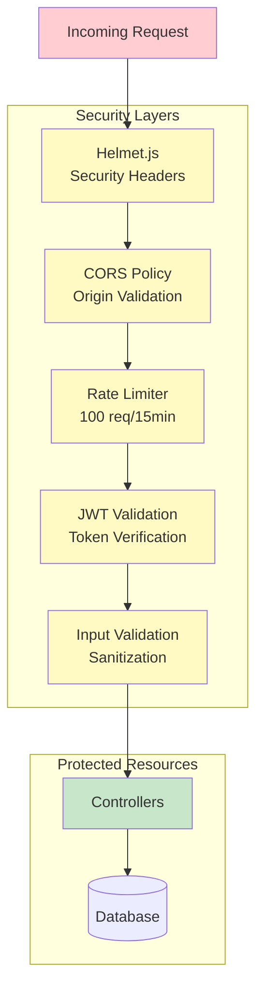

# ResumeAI System Architecture

## High-Level System Architecture

## Technology Stack

### Frontend
- **Framework**: React 18 with Vite
- **UI Library**: Material Design 3 + Tailwind CSS
- **State Management**: React Context API
- **Routing**: React Router v6
- **HTTP Client**: Axios
- **Charts**: Recharts
- **Icons**: Material Symbols

### Backend
- **Runtime**: Node.js
- **Framework**: Express.js
- **Authentication**: JWT + bcryptjs
- **File Upload**: Multer
- **PDF Processing**: pdf-parse
- **Email**: Nodemailer
- **Validation**: express-validator

### Database & Storage
- **Primary Database**: MongoDB Atlas (User & Resume Data)
- **Vector Database**: ChromaDB (Semantic Search)
- **File Storage**: Local File System
- **Session Storage**: JWT Tokens

### AI & Machine Learning
- **LLM**: Google Gemini 1.5 Pro
- **Embeddings**: Google Generative AI Embeddings
- **Vector Search**: ChromaDB
- **RAG Pipeline**: Custom Implementation

### Security
- **Authentication**: JWT with HTTP-only Cookies
- **Password Hashing**: bcryptjs (10 rounds)
- **Rate Limiting**: express-rate-limit
- **CORS**: Configured for frontend origin
- **Input Validation**: express-validator
- **XSS Protection**: Helmet.js

## Deployment Architecture

## Security Architecture

## Scalability Considerations

### Horizontal Scaling
- **Stateless Architecture**: All session data in JWT tokens
- **Load Balancing**: Multiple Node.js instances behind load balancer
- **Database Clustering**: MongoDB replica sets for read scaling
- **Caching Strategy**: Redis for session and API response caching (future)

### Vertical Scaling
- **Database Indexing**: Optimized indexes on frequently queried fields
- **Connection Pooling**: Mongoose connection pool management
- **Lazy Loading**: Frontend lazy loading for route components
- **Code Splitting**: Webpack/Vite code splitting for optimal bundle size

### Performance Optimization
- **CDN**: Static assets served via CDN
- **Compression**: Gzip/Brotli compression for API responses
- **Image Optimization**: Optimized asset delivery
- **Query Optimization**: Database query optimization with indexes
- **Memoization**: React.memo and useMemo for component optimization
