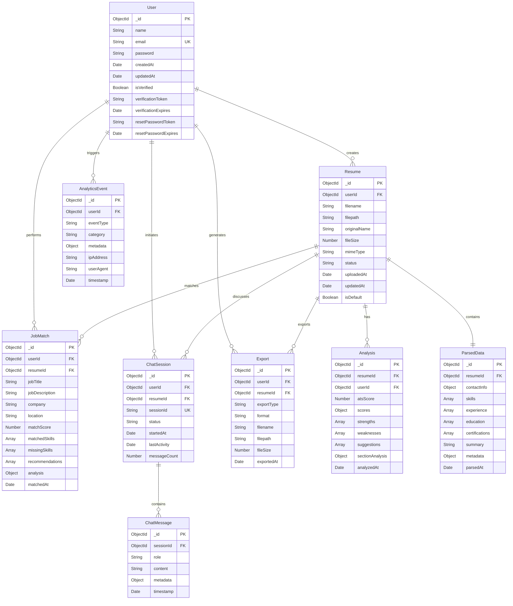

# ResumeAI Database Schema

## Database ER Diagram



## Collection Details

### Users Collection

**Purpose**: Store user account information and authentication data

```javascript
{
  _id: ObjectId,
  name: String (required, min: 2, max: 100),
  email: String (required, unique, lowercase),
  password: String (required, hashed with bcrypt),
  createdAt: Date (default: now),
  updatedAt: Date (default: now),
  isVerified: Boolean (default: false),
  verificationToken: String (optional),
  verificationExpires: Date (optional),
  resetPasswordToken: String (optional),
  resetPasswordExpires: Date (optional)
}
```

**Indexes**:
- `{ email: 1 }` (unique)
- `{ createdAt: -1 }`
- `{ verificationToken: 1 }` (sparse)
- `{ resetPasswordToken: 1 }` (sparse)

### Resumes Collection

**Purpose**: Store uploaded resume metadata and file information

```javascript
{
  _id: ObjectId,
  userId: ObjectId (required, ref: 'User'),
  filename: String (required),
  filepath: String (required),
  originalName: String (required),
  fileSize: Number (required),
  mimeType: String (required),
  status: String (enum: ['uploaded', 'parsing', 'parsed', 'error'], default: 'uploaded'),
  uploadedAt: Date (default: now),
  updatedAt: Date (default: now),
  isDefault: Boolean (default: false)
}
```

**Indexes**:
- `{ userId: 1, uploadedAt: -1 }`
- `{ userId: 1, isDefault: 1 }`
- `{ status: 1 }`

### ParsedData Collection

**Purpose**: Store structured data extracted from resumes

```javascript
{
  _id: ObjectId,
  resumeId: ObjectId (required, unique, ref: 'Resume'),
  contactInfo: {
    name: String,
    email: String,
    phone: String,
    location: String,
    linkedin: String,
    github: String,
    portfolio: String
  },
  skills: [{
    name: String,
    category: String,
    proficiency: String
  }],
  experience: [{
    company: String,
    position: String,
    location: String,
    startDate: String,
    endDate: String,
    description: [String],
    achievements: [String]
  }],
  education: [{
    institution: String,
    degree: String,
    field: String,
    location: String,
    startDate: String,
    endDate: String,
    gpa: String,
    achievements: [String]
  }],
  certifications: [{
    name: String,
    issuer: String,
    date: String,
    credentialId: String
  }],
  summary: String,
  metadata: {
    totalYearsExperience: Number,
    educationLevel: String,
    industryFocus: [String]
  },
  parsedAt: Date (default: now)
}
```

**Indexes**:
- `{ resumeId: 1 }` (unique)
- `{ 'skills.name': 1 }`
- `{ parsedAt: -1 }`

### Analyses Collection

**Purpose**: Store ATS analysis results for resumes

```javascript
{
  _id: ObjectId,
  resumeId: ObjectId (required, ref: 'Resume'),
  userId: ObjectId (required, ref: 'User'),
  atsScore: Number (required, min: 0, max: 100),
  scores: {
    formatting: Number,
    keywords: Number,
    experience: Number,
    education: Number,
    skills: Number,
    impact: Number
  },
  strengths: [String],
  weaknesses: [String],
  suggestions: [{
    category: String,
    priority: String,
    suggestion: String,
    impact: String
  }],
  sectionAnalysis: {
    contactInfo: Object,
    summary: Object,
    experience: Object,
    education: Object,
    skills: Object
  },
  analyzedAt: Date (default: now)
}
```

**Indexes**:
- `{ resumeId: 1, analyzedAt: -1 }`
- `{ userId: 1, analyzedAt: -1 }`
- `{ atsScore: -1 }`

### JobMatches Collection

**Purpose**: Store job matching analysis results

```javascript
{
  _id: ObjectId,
  userId: ObjectId (required, ref: 'User'),
  resumeId: ObjectId (required, ref: 'Resume'),
  jobTitle: String (required),
  jobDescription: String (required),
  company: String,
  location: String,
  matchScore: Number (required, min: 0, max: 100),
  matchedSkills: [{
    skill: String,
    relevance: String
  }],
  missingSkills: [{
    skill: String,
    importance: String
  }],
  recommendations: [String],
  analysis: {
    skillsMatch: Number,
    experienceMatch: Number,
    educationMatch: Number,
    overallFit: String,
    keyStrengths: [String],
    gapsToAddress: [String]
  },
  matchedAt: Date (default: now)
}
```

**Indexes**:
- `{ userId: 1, matchedAt: -1 }`
- `{ resumeId: 1, matchedAt: -1 }`
- `{ matchScore: -1 }`

### ChatSessions Collection

**Purpose**: Store AI chat session metadata

```javascript
{
  _id: ObjectId,
  userId: ObjectId (required, ref: 'User'),
  resumeId: ObjectId (required, ref: 'Resume'),
  sessionId: String (required, unique),
  status: String (enum: ['active', 'ended'], default: 'active'),
  startedAt: Date (default: now),
  lastActivity: Date (default: now),
  messageCount: Number (default: 0)
}
```

**Indexes**:
- `{ sessionId: 1 }` (unique)
- `{ userId: 1, lastActivity: -1 }`
- `{ resumeId: 1, lastActivity: -1 }`

### ChatMessages Collection

**Purpose**: Store individual chat messages

```javascript
{
  _id: ObjectId,
  sessionId: ObjectId (required, ref: 'ChatSession'),
  role: String (enum: ['user', 'assistant'], required),
  content: String (required),
  metadata: {
    tokensUsed: Number,
    retrievedContext: [String],
    confidence: Number
  },
  timestamp: Date (default: now)
}
```

**Indexes**:
- `{ sessionId: 1, timestamp: 1 }`
- `{ timestamp: -1 }`

### Exports Collection

**Purpose**: Track resume exports and downloads

```javascript
{
  _id: ObjectId,
  userId: ObjectId (required, ref: 'User'),
  resumeId: ObjectId (required, ref: 'Resume'),
  exportType: String (enum: ['pdf', 'json', 'docx'], required),
  format: String,
  filename: String (required),
  filepath: String (required),
  fileSize: Number,
  exportedAt: Date (default: now)
}
```

**Indexes**:
- `{ userId: 1, exportedAt: -1 }`
- `{ resumeId: 1, exportedAt: -1 }`

### AnalyticsEvents Collection

**Purpose**: Track user activities and system events

```javascript
{
  _id: ObjectId,
  userId: ObjectId (ref: 'User'),
  eventType: String (required),
  category: String (enum: ['resume', 'analysis', 'match', 'chat', 'export', 'auth']),
  metadata: Object,
  ipAddress: String,
  userAgent: String,
  timestamp: Date (default: now)
}
```

**Indexes**:
- `{ userId: 1, timestamp: -1 }`
- `{ eventType: 1, timestamp: -1 }`
- `{ timestamp: -1 }`

## Vector Database (ChromaDB)

### Resume Embeddings Collection

**Purpose**: Store resume content embeddings for semantic search

```javascript
{
  id: String (resumeId),
  embedding: Float32Array (384 dimensions),
  metadata: {
    userId: String,
    filename: String,
    uploadedAt: String,
    skills: [String],
    experience: [String]
  },
  document: String (concatenated resume text)
}
```

**Search Operations**:
- Similarity search by query text
- Filtered search by user ID
- Multi-modal search (text + metadata)

## Database Performance

### Query Optimization
- Compound indexes for common query patterns
- Covered queries where possible
- Projection to reduce data transfer
- Aggregation pipeline optimization

### Connection Management
- Connection pooling (min: 5, max: 10)
- Automatic reconnection on failure
- Read preference: primaryPreferred
- Write concern: majority

### Backup Strategy
- Automated daily backups (MongoDB Atlas)
- Point-in-time recovery enabled
- 7-day retention for ChromaDB snapshots
- Export backups stored in S3
