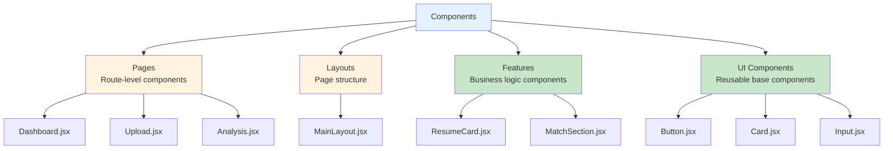
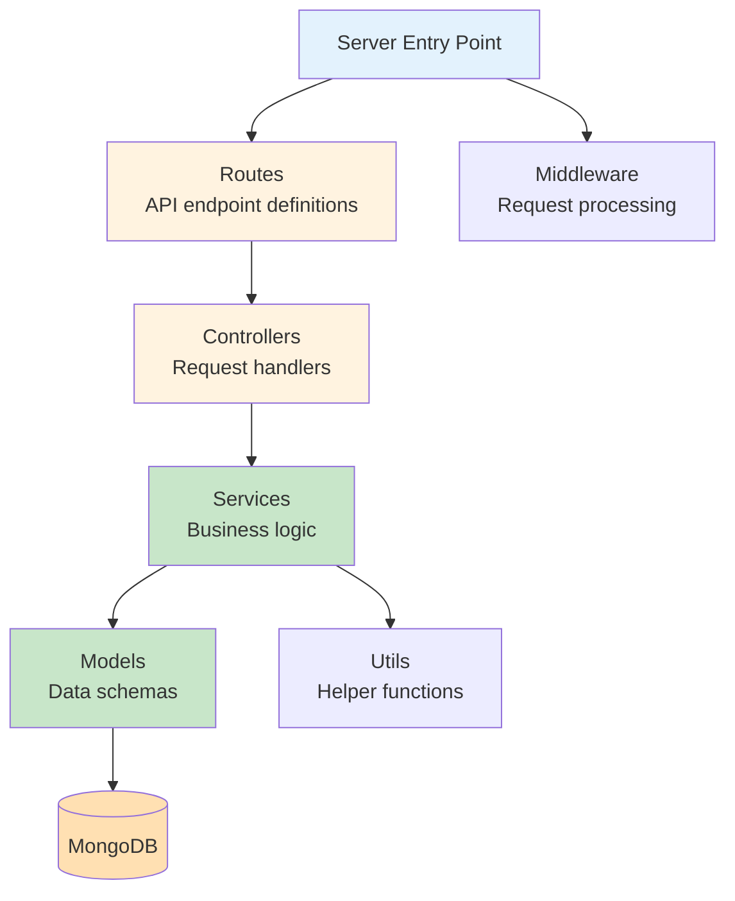
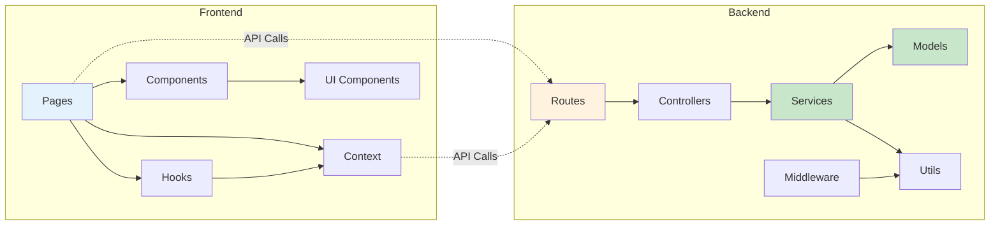
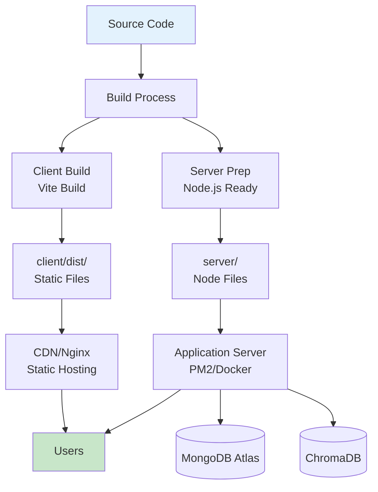

# ResumeAI Project Structure

## Complete Folder Hierarchy

```mermaid
graph TB
    Root[Resume ATS Analyzer]
    
    Root --> Client[client/<br/>React Frontend]
    Root --> Server[server/<br/>Node.js Backend]
    Root --> Docs[docs/<br/>Documentation]
    Root --> RootFiles[Root Files]
    
    Client --> ClientSrc[src/]
    Client --> ClientConfig[Config Files]
    Client --> ClientDist[dist/<br/>Build Output]
    Client --> ClientModules[node_modules/]
    
    ClientSrc --> Pages[pages/<br/>Route Components]
    ClientSrc --> Components[components/<br/>Reusable Components]
    ClientSrc --> Layouts[layouts/<br/>Layout Components]
    ClientSrc --> Context[context/<br/>Global State]
    ClientSrc --> Hooks[hooks/<br/>Custom Hooks]
    ClientSrc --> Assets[assets/<br/>Static Files]
    ClientSrc --> Styles[index.css]
    ClientSrc --> Main[main.jsx]
    ClientSrc --> App[App.jsx]
    
    Components --> UI[ui/<br/>Base Components]
    Components --> Dashboard[dashboard/<br/>Dashboard Components]
    Components --> Feature[Feature Components]
    
    Server --> ServerSrc[Source Files]
    Server --> ServerConfig[Config Files]
    Server --> ServerModules[node_modules/]
    Server --> Uploads[uploads/<br/>Resume Storage]
    Server --> Exports[exports/<br/>Export Files]
    
    ServerSrc --> Controllers[controllers/<br/>Request Handlers]
    ServerSrc --> Models[models/<br/>Mongoose Schemas]
    ServerSrc --> Routes[routes/<br/>API Endpoints]
    ServerSrc --> Services[services/<br/>Business Logic]
    ServerSrc --> Middleware[middleware/<br/>Express Middleware]
    ServerSrc --> Utils[utils/<br/>Helper Functions]
    ServerSrc --> Scripts[scripts/<br/>Utility Scripts]
    ServerSrc --> Examples[examples/<br/>Code Examples]
    ServerSrc --> ServerIndex[server.js<br/>Entry Point]
    
    RootFiles --> Readme[README.md]
    RootFiles --> Contributing[CONTRIBUTING.md]
    RootFiles --> Changelog[CHANGELOG.md]
    RootFiles --> Git[.gitignore]
    RootFiles --> Package[package.json]

    style Root fill:#e3f2fd
    style Client fill:#fff3e0
    style Server fill:#fff3e0
    style Docs fill:#c8e6c9
```



## Detailed Structure

### Frontend (client/)

```
client/
├── dist/                          # Production build output
│   ├── index.html                 # Built HTML
│   ├── assets/                    # Built JS/CSS bundles
│   └── ...
│
├── node_modules/                  # Frontend dependencies
│
├── public/                        # Public static assets
│   └── vite.svg                   # Vite logo
│
├── src/                           # Source code
│   ├── assets/                    # Static assets
│   │   └── .gitkeep
│   │
│   ├── components/                # React components
│   │   ├── dashboard/             # Dashboard-specific components
│   │   │   ├── ActivityTimeline.jsx
│   │   │   ├── ChartCard.jsx
│   │   │   ├── DashboardSkeleton.jsx
│   │   │   ├── DefaultResumeCard.jsx
│   │   │   ├── EmptyStateCard.jsx
│   │   │   ├── index.js
│   │   │   ├── LoadingSkeleton.jsx
│   │   │   ├── OptimizedChart.jsx
│   │   │   ├── QuickActions.jsx
│   │   │   ├── RecentExports.jsx
│   │   │   ├── RecentItem.jsx
│   │   │   └── StatCard.jsx
│   │   │
│   │   ├── ui/                    # Base UI components
│   │   │   ├── Button.jsx
│   │   │   ├── Card.jsx
│   │   │   ├── index.js
│   │   │   ├── Input.jsx
│   │   │   ├── Loader.jsx
│   │   │   ├── MaterialIcon.jsx
│   │   │   └── ScoreCard.jsx
│   │   │
│   │   ├── AnalysisSection.jsx
│   │   ├── ATSScoreCard.jsx
│   │   ├── BackendStatus.jsx
│   │   ├── ConfirmDialog.jsx
│   │   ├── EmptyState.jsx
│   │   ├── ErrorBoundary.jsx
│   │   ├── FeatureSection.jsx
│   │   ├── Footer.jsx
│   │   ├── index.js
│   │   ├── LoadingSpinner.jsx
│   │   ├── MatchScoreCard.jsx
│   │   ├── MatchSection.jsx
│   │   ├── Navbar.jsx
│   │   ├── NotificationBanner.jsx
│   │   ├── ParsedSection.jsx
│   │   ├── ProtectedRoute.jsx
│   │   ├── PublicRoute.jsx
│   │   ├── ResumeCard.jsx
│   │   ├── ResumeList.jsx
│   │   └── ResumeUpload.jsx
│   │
│   ├── context/                   # React Context providers
│   │   └── AuthContext.jsx        # Authentication context
│   │
│   ├── hooks/                     # Custom React hooks
│   │   ├── .gitkeep
│   │   ├── useAnalytics.js
│   │   └── useDashboard.js
│   │
│   ├── layouts/                   # Layout components
│   │   └── MainLayout.jsx
│   │
│   ├── pages/                     # Page components (routes)
│   │   ├── Analysis.jsx           # Resume analysis page
│   │   ├── AnalyticsDashboard.jsx # Analytics page
│   │   ├── AnalyticsDashboardOptimized.jsx
│   │   ├── CareerAssistant.jsx    # Career tools page
│   │   ├── Dashboard.jsx          # Main dashboard
│   │   ├── DashboardEnhanced.jsx
│   │   ├── ForgotPassword.jsx     # Password reset
│   │   ├── JobMatch.jsx           # Job matching page
│   │   ├── JobMatchHistory.jsx    # Match history
│   │   ├── Landing.jsx            # Landing page
│   │   ├── Login.jsx              # Login page
│   │   ├── Register.jsx           # Registration page
│   │   ├── ResetPassword.jsx      # Password reset form
│   │   ├── ResumeChat.jsx         # AI chat page
│   │   ├── ResumeDetails.jsx      # Resume details page
│   │   ├── Resumes.jsx            # Resume list page
│   │   └── Upload.jsx             # Resume upload page
│   │
│   ├── App.jsx                    # Main App component
│   ├── index.css                  # Global styles (Tailwind)
│   └── main.jsx                   # Entry point
│
├── .env                           # Environment variables
├── .env.example                   # Environment template
├── index.html                     # HTML template
├── package.json                   # Dependencies & scripts
├── package-lock.json              # Dependency lock file
├── postcss.config.js              # PostCSS config
├── tailwind.config.js             # Tailwind CSS config
└── vite.config.js                 # Vite bundler config
```

### Backend (server/)

```
server/
├── node_modules/                  # Backend dependencies
│
├── controllers/                   # Request handlers
│   ├── analyticsController.js     # Analytics endpoints
│   ├── authController.js          # Authentication logic
│   ├── careerController.js        # Career tools logic
│   ├── chatController.js          # AI chat logic
│   ├── exportController.js        # Export functionality
│   ├── jobMatchController.js      # Job matching logic
│   ├── resumeController.js        # Resume CRUD operations
│   └── searchController.js        # Search functionality
│
├── examples/                      # Code examples
│   └── searchIntegration.js       # Search integration example
│
├── exports/                       # Generated export files
│   └── .gitkeep
│
├── middleware/                    # Express middleware
│   ├── auth.js                    # JWT authentication
│   ├── errorHandler.js            # Global error handler
│   ├── rateLimiter.js             # Rate limiting
│   └── validator.js               # Input validation
│
├── models/                        # Mongoose schemas
│   ├── Analysis.js                # Analysis schema
│   ├── ChatMessage.js             # Chat message schema
│   ├── ChatSession.js             # Chat session schema
│   ├── Export.js                  # Export schema
│   ├── JobMatch.js                # Job match schema
│   ├── ParsedData.js              # Parsed resume schema
│   └── User.js                    # User schema
│
├── routes/                        # API route definitions
│   ├── analytics.js               # Analytics routes
│   ├── auth.js                    # Auth routes
│   ├── career.js                  # Career routes
│   ├── chat.js                    # Chat routes
│   ├── export.js                  # Export routes
│   ├── jobMatch.js                # Job match routes
│   ├── resumes.js                 # Resume routes
│   └── searchRoutes.js            # Search routes
│
├── scripts/                       # Utility scripts
│   ├── manageRAG.js               # RAG management script
│   ├── setupRAG.js                # RAG setup script
│   └── testSearch.js              # Search testing script
│
├── services/                      # Business logic services
│   ├── aiService.js               # Google Gemini integration
│   ├── careerService.js           # Career tools service
│   ├── emailService.js            # Email sending service
│   ├── exportService.js           # Export generation service
│   ├── pdfService.js              # PDF parsing service
│   ├── ragPipeline.js             # RAG implementation
│   └── searchService.js           # Semantic search service
│
├── uploads/                       # Uploaded resume files
│   └── .gitkeep
│
├── utils/                         # Helper utilities
│   ├── constants.js               # App constants
│   ├── logger.js                  # Logging utility
│   ├── ragLogger.js               # RAG logging
│   ├── ragPreparation.js          # RAG data prep
│   └── ragSetup.js                # RAG initialization
│
├── .env                           # Environment variables
├── .env.example                   # Environment template
├── package.json                   # Dependencies & scripts
├── package-lock.json              # Dependency lock file
├── RAG_COMPLETE.md                # RAG documentation
└── server.js                      # Express server entry point
```

### Documentation (docs/)

```
docs/
├── AI_CHAT.md                     # AI chat sequence diagrams
├── API_FLOW.md                    # Backend request flow
├── ARCHITECTURE.md                # System architecture
├── DATABASE.md                    # Database ER diagrams
├── FOLDER_STRUCTURE.md            # This file
└── RAG_PIPELINE.md                # RAG pipeline details
```

### Root Files

```
.
├── .git/                          # Git repository
├── .vscode/                       # VS Code settings
├── client/                        # Frontend folder
├── server/                        # Backend folder
├── docs/                          # Documentation folder
├── .gitignore                     # Git ignore rules
├── CHANGELOG.md                   # Version history
├── CONTRIBUTING.md                # Contribution guidelines
├── package.json                   # Root package.json (optional)
├── package-lock.json              # Root dependency lock
└── README.md                      # Main project README
```

## Component Organization Patterns

### Frontend Component Types



### Backend Module Organization



## File Naming Conventions

### Frontend
- **Components**: PascalCase (e.g., `ResumeCard.jsx`)
- **Hooks**: camelCase with "use" prefix (e.g., `useDashboard.js`)
- **Utils**: camelCase (e.g., `formatDate.js`)
- **Pages**: PascalCase (e.g., `Dashboard.jsx`)
- **Styles**: kebab-case (e.g., `button-styles.css`)

### Backend
- **Controllers**: camelCase with "Controller" suffix (e.g., `authController.js`)
- **Models**: PascalCase (e.g., `User.js`)
- **Routes**: camelCase (e.g., `auth.js`)
- **Services**: camelCase with "Service" suffix (e.g., `aiService.js`)
- **Middleware**: camelCase (e.g., `auth.js`)
- **Utils**: camelCase (e.g., `logger.js`)

## Import Path Aliases

### Recommended Aliases (not currently configured)

```javascript
// Frontend (vite.config.js / jsconfig.json)
{
  "@components": "./src/components",
  "@pages": "./src/pages",
  "@hooks": "./src/hooks",
  "@context": "./src/context",
  "@layouts": "./src/layouts",
  "@assets": "./src/assets",
  "@ui": "./src/components/ui"
}

// Backend (jsconfig.json)
{
  "@controllers": "./controllers",
  "@models": "./models",
  "@services": "./services",
  "@middleware": "./middleware",
  "@utils": "./utils",
  "@routes": "./routes"
}
```

## Module Dependencies



## Build & Deployment Structure



## Storage Directories

### Uploads Directory Structure
```
server/uploads/
├── {userId}/
│   ├── {resumeId}_original.pdf
│   ├── {resumeId}_compressed.pdf
│   └── ...
└── temp/
    └── {tempId}.pdf (deleted after processing)
```

### Exports Directory Structure
```
server/exports/
├── {userId}/
│   ├── resume_{resumeId}_{timestamp}.pdf
│   ├── resume_{resumeId}_{timestamp}.json
│   └── ...
└── temp/
    └── {tempId}.pdf (deleted after download)
```

## Environment Files Location

```
.
├── client/.env                    # Frontend environment
├── client/.env.example            # Frontend template
├── server/.env                    # Backend environment
└── server/.env.example            # Backend template
```

## Git Ignore Patterns

Key ignored directories:
- `node_modules/` (both client & server)
- `dist/` (client build output)
- `.env` (environment files)
- `uploads/` (resume files - except .gitkeep)
- `exports/` (export files - except .gitkeep)
- `*.log` (log files)
