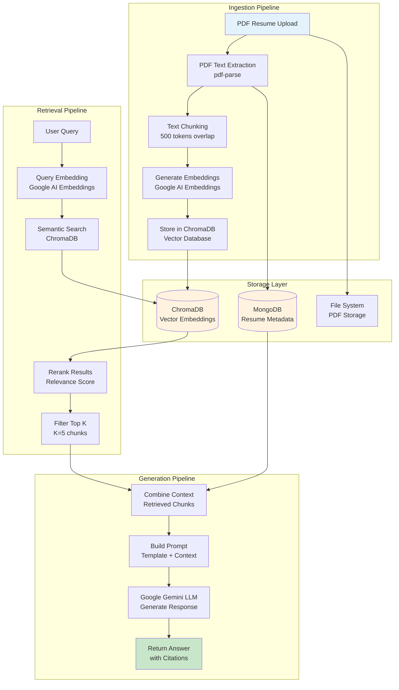
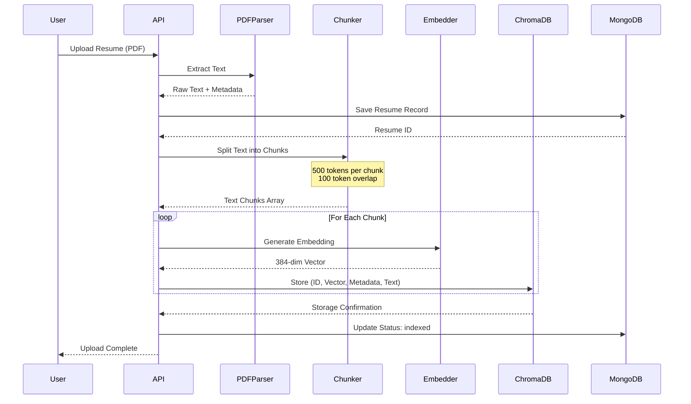
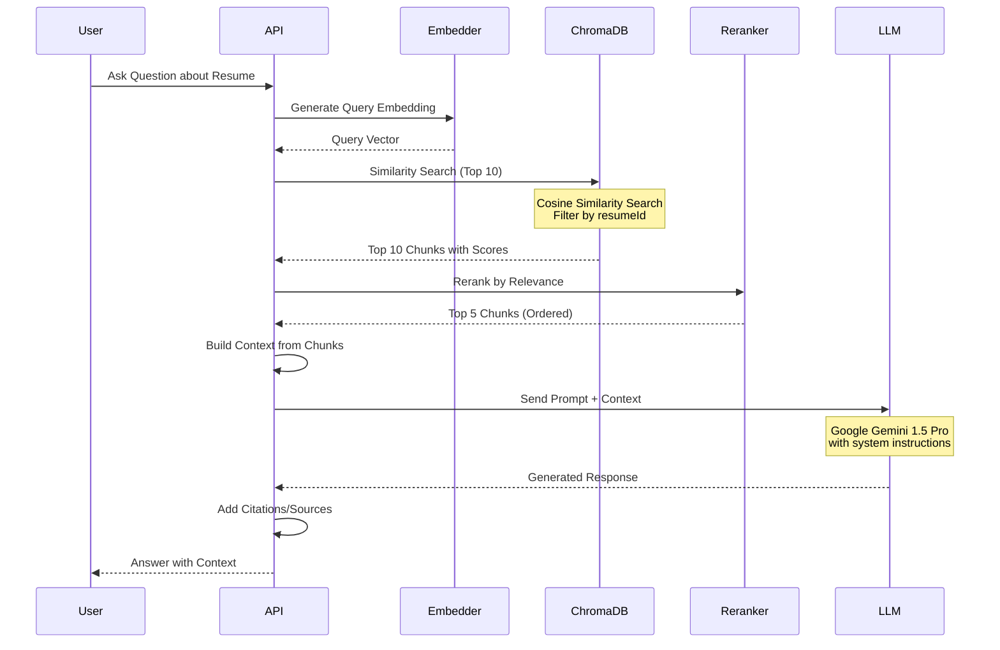
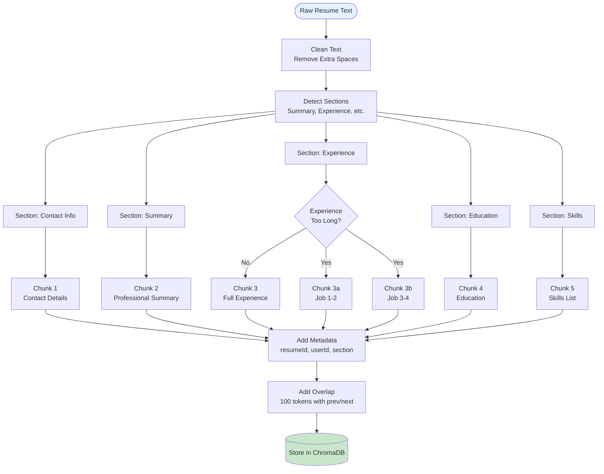
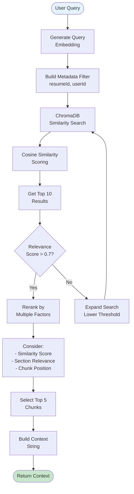
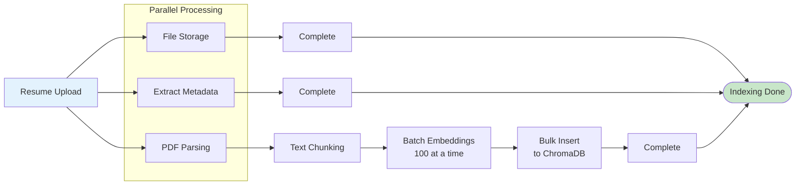
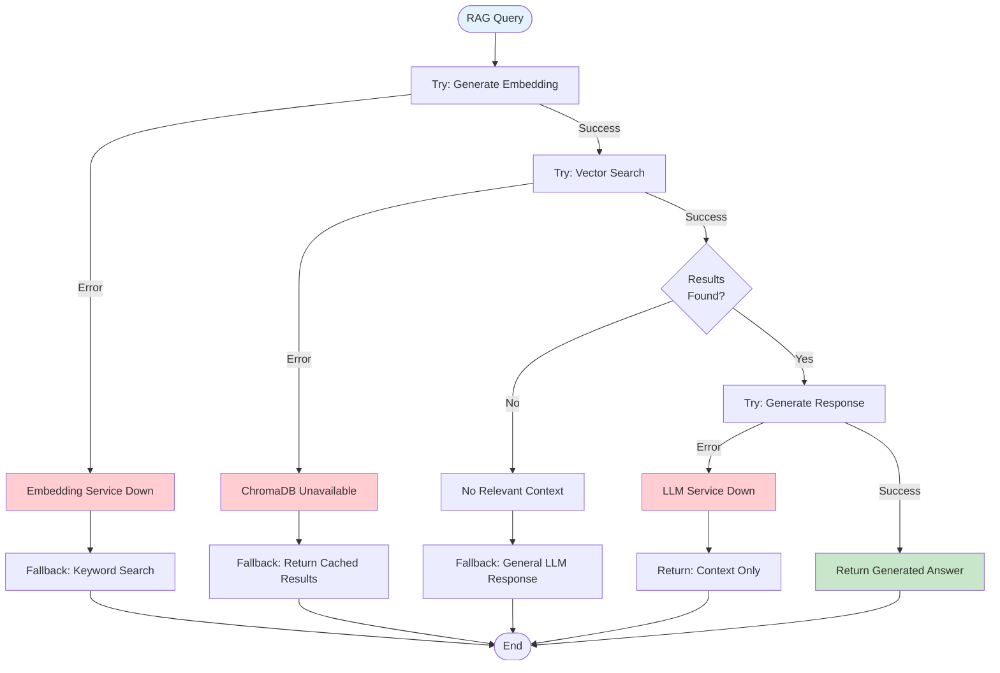

# ResumeAI RAG Pipeline Documentation

## RAG (Retrieval-Augmented Generation) Architecture



## Detailed RAG Flow

### 1. Document Ingestion Flow



### 2. Query Processing Flow



## Text Chunking Strategy



## Embedding Generation

### Embedding Model Specifications
- **Model**: Google Generative AI Embeddings
- **Dimension**: 384 (text-embedding-004)
- **Max Input**: 2048 tokens per chunk
- **Batch Size**: 100 documents per API call
- **Normalization**: L2 normalized vectors

### Metadata Schema
```javascript
{
  resumeId: String,
  userId: String,
  section: String, // 'contact', 'summary', 'experience', etc.
  chunkIndex: Number,
  totalChunks: Number,
  filename: String,
  uploadedAt: String,
  skills: [String], // Extracted skills for filtering
  yearsExperience: Number // For filtering
}
```

## Semantic Search Process



## Prompt Engineering

### System Prompt Template
```
You are ResumeAI, an intelligent assistant specialized in analyzing resumes and providing career guidance.

Context: The following information is from the user's resume:
{retrieved_context}

Guidelines:
1. Base your responses ONLY on the provided context
2. If information is not in the context, say "I don't have that information in your resume"
3. Be specific and cite sections when possible
4. Provide actionable advice
5. Maintain a professional but friendly tone

User Question: {user_query}
```

### Context Building
```javascript
function buildContext(chunks) {
  let context = "";
  
  chunks.forEach((chunk, index) => {
    context += `[Source ${index + 1} - ${chunk.metadata.section}]\n`;
    context += chunk.document + "\n\n";
  });
  
  return context;
}
```

## RAG Performance Optimization

### Indexing Optimization


### Query Optimization
- **Caching**: Cache common queries and embeddings (Redis)
- **Batch Processing**: Process multiple queries in parallel
- **Lazy Loading**: Load context only when needed
- **Connection Pooling**: Reuse ChromaDB connections

## RAG Quality Metrics

### Retrieval Metrics
- **Precision@K**: Relevant chunks in top K results
- **Recall@K**: Retrieved relevant chunks / total relevant
- **MRR**: Mean Reciprocal Rank of first relevant result
- **NDCG**: Normalized Discounted Cumulative Gain

### Generation Metrics
- **Faithfulness**: Response accuracy to retrieved context
- **Answer Relevance**: Response relevance to query
- **Context Relevance**: Retrieved context relevance to query
- **Latency**: End-to-end response time (target: <3s)

## Error Handling



## Future Enhancements

### Planned Features
1. **Hybrid Search**: Combine semantic + keyword search
2. **Multi-Resume Search**: Query across multiple resumes
3. **Conversation Memory**: Maintain chat context across sessions
4. **Fine-tuned Embeddings**: Custom embedding model for resumes
5. **Query Expansion**: Automatic query reformulation
6. **Contextual Compression**: Smart context trimming for long resumes
7. **A/B Testing**: Compare different chunking strategies
8. **Real-time Indexing**: Incremental updates instead of full reindex
