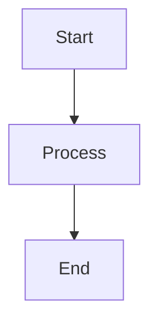
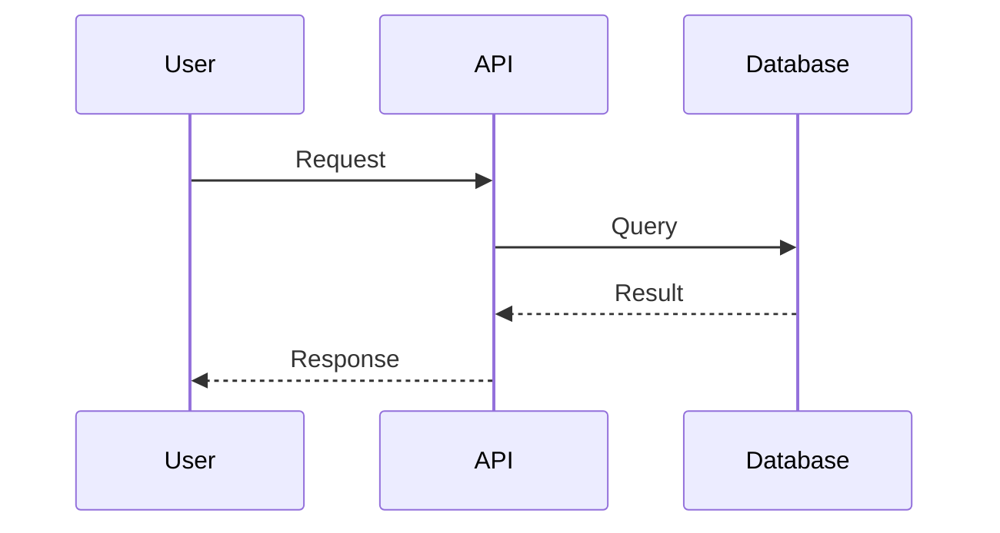
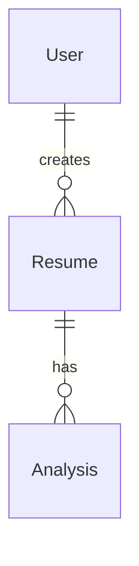
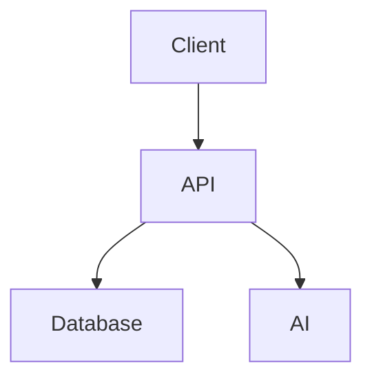

# ResumeAI Technical Documentation

Welcome to the ResumeAI technical documentation. This directory contains comprehensive diagrams and documentation for the system architecture, data flow, and implementation details.

## Documentation Index

### 📐 [System Architecture](./ARCHITECTURE.md)
Complete system architecture documentation including:
- High-level system architecture diagram
- Technology stack overview
- Deployment architecture
- Security architecture
- Scalability considerations
- Performance optimization strategies

**Use this when**: Understanding the overall system design, technology choices, or deployment strategy.

### 🗄️ [Database Schema](./DATABASE.md)
Complete database documentation including:
- Entity-Relationship (ER) diagram
- Detailed collection schemas for MongoDB
- Vector database (ChromaDB) structure
- Indexes and query optimization
- Backup and recovery strategies

**Use this when**: Understanding data models, designing new features that require database changes, or optimizing queries.

### 🔄 [API Request Flow](./API_FLOW.md)
Backend request flow documentation including:
- Complete request processing pipeline
- Feature-specific flow diagrams (registration, upload, job matching, export)
- Middleware pipeline
- Error handling flow
- Response format standards

**Use this when**: Understanding how API requests are processed, implementing new endpoints, or debugging API issues.

### 🤖 [RAG Pipeline](./RAG_PIPELINE.md)
Retrieval-Augmented Generation implementation including:
- RAG architecture overview
- Document ingestion pipeline
- Query processing flow
- Text chunking strategy
- Semantic search process
- Performance optimization

**Use this when**: Understanding or improving the AI chat functionality, semantic search, or context retrieval.

### 💬 [AI Chat Flow](./AI_CHAT.md)
AI Resume Chat sequence diagrams including:
- Complete chat interaction flow
- Session management
- Message processing pipeline
- Context building strategy
- Conversation types (retrieval, analysis, comparison, multi-turn)
- Real-time streaming
- Error handling

**Use this when**: Understanding the chat feature, implementing chat improvements, or debugging chat issues.

### 📁 [Folder Structure](./FOLDER_STRUCTURE.md)
Complete project structure documentation including:
- Visual folder hierarchy
- Detailed frontend structure
- Detailed backend structure
- Component organization patterns
- File naming conventions
- Import path recommendations
- Build and deployment structure

**Use this when**: Navigating the codebase, organizing new features, or onboarding new developers.

## Diagram Format

All diagrams in this documentation use **Mermaid** syntax, which is:
- ✅ Rendered automatically on GitHub
- ✅ Easy to edit and maintain
- ✅ Version control friendly
- ✅ Supports multiple diagram types (flowcharts, sequences, ER diagrams, etc.)

### Viewing Diagrams

#### On GitHub
Simply open any `.md` file on GitHub, and the Mermaid diagrams will render automatically.

#### Locally
To view Mermaid diagrams locally:

1. **VS Code** (recommended):
   - Install the "Markdown Preview Mermaid Support" extension
   - Open any `.md` file
   - Press `Ctrl+Shift+V` (Windows/Linux) or `Cmd+Shift+V` (Mac) for preview

2. **Browser**:
   - Use the [Mermaid Live Editor](https://mermaid.live/)
   - Copy and paste diagram code

3. **CLI Tool**:
   ```bash
   npm install -g @mermaid-js/mermaid-cli
   mmdc -i docs/ARCHITECTURE.md -o architecture.pdf
   ```

## Documentation Maintenance

### When to Update

Update these documents when:
- ✏️ Adding new features that change architecture
- ✏️ Modifying database schemas
- ✏️ Changing API endpoints or request flows
- ✏️ Reorganizing folder structure
- ✏️ Updating technology stack

### How to Update

1. Edit the relevant `.md` file
2. Update Mermaid diagram code
3. Test diagram rendering on GitHub or locally
4. Update the last updated date below
5. Commit with descriptive message: `docs: update [diagram name]`

## Quick Navigation

### By Role

**Frontend Developers**:
- Start with [Folder Structure](./FOLDER_STRUCTURE.md) → Frontend section
- Review [API Flow](./API_FLOW.md) for API integration
- Check [Architecture](./ARCHITECTURE.md) for frontend architecture

**Backend Developers**:
- Start with [Folder Structure](./FOLDER_STRUCTURE.md) → Backend section
- Review [API Flow](./API_FLOW.md) for request processing
- Check [Database](./DATABASE.md) for data models
- Review [RAG Pipeline](./RAG_PIPELINE.md) for AI features

**DevOps Engineers**:
- Start with [Architecture](./ARCHITECTURE.md) → Deployment
- Review [Database](./DATABASE.md) for backup strategies
- Check [Folder Structure](./FOLDER_STRUCTURE.md) → Build structure

**New Contributors**:
- Start with [Architecture](./ARCHITECTURE.md) for system overview
- Then [Folder Structure](./FOLDER_STRUCTURE.md) for codebase navigation
- Review feature-specific docs as needed

### By Task

| Task | Relevant Documentation |
|------|----------------------|
| Add new API endpoint | [API Flow](./API_FLOW.md), [Folder Structure](./FOLDER_STRUCTURE.md) |
| Modify database schema | [Database](./DATABASE.md), [Architecture](./ARCHITECTURE.md) |
| Improve AI chat | [AI Chat](./AI_CHAT.md), [RAG Pipeline](./RAG_PIPELINE.md) |
| Add new page/component | [Folder Structure](./FOLDER_STRUCTURE.md), [Architecture](./ARCHITECTURE.md) |
| Debug performance | [Architecture](./ARCHITECTURE.md), [API Flow](./API_FLOW.md) |
| Setup deployment | [Architecture](./ARCHITECTURE.md), [Database](./DATABASE.md) |
| Improve semantic search | [RAG Pipeline](./RAG_PIPELINE.md) |
| Add authentication | [API Flow](./API_FLOW.md), [Architecture](./ARCHITECTURE.md) |

## Diagram Types Used

### Flowchart

**Used for**: Request flows, decision trees, processing pipelines

### Sequence Diagram

**Used for**: API interactions, chat flows, authentication flows

### Entity-Relationship Diagram

**Used for**: Database schemas, data relationships

### Graph/Architecture Diagram

**Used for**: System architecture, component relationships

## Contributing to Documentation

### Adding New Diagrams

1. Choose appropriate diagram type
2. Follow existing style conventions
3. Add clear labels and descriptions
4. Test rendering on GitHub
5. Update this README index

### Style Guidelines

- **Colors**: Use consistent color scheme
  - Blue (`#e3f2fd`) for user-facing components
  - Orange (`#fff3e0`) for API/middleware
  - Green (`#c8e6c9`) for services/success
  - Red (`#ffcdd2`) for errors
  - Yellow (`#fff9c4`) for security layers

- **Labels**: Use clear, concise labels
- **Layout**: Organize logically (top-to-bottom or left-to-right)
- **Notes**: Add notes for complex interactions

## Additional Resources

### External Links
- [Mermaid Documentation](https://mermaid.js.org/)
- [MongoDB Schema Design](https://www.mongodb.com/docs/manual/data-modeling/)
- [Google Gemini API](https://ai.google.dev/)
- [ChromaDB Documentation](https://docs.trychroma.com/)
- [Express.js Best Practices](https://expressjs.com/en/advanced/best-practice-performance.html)
- [React Best Practices](https://react.dev/learn)

### Related Project Files
- [Main README](../README.md) - Project overview and setup
- [Contributing Guide](../CONTRIBUTING.md) - Contribution guidelines
- [Changelog](../CHANGELOG.md) - Version history

## Support

For questions about this documentation:
1. Check the relevant document first
2. Search existing issues on GitHub
3. Create a new issue with tag `documentation`
4. Contact the development team

---

**Last Updated**: January 2025  
**Maintained By**: ResumeAI Development Team  
**Documentation Version**: 1.0.0
